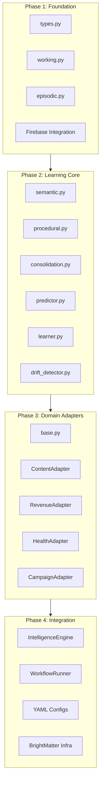

# MH1 Intelligence System: 4-Phase Implementation Plan

This plan implements the complete MH1 Intelligence System as defined in [MH1_INTELLIGENCE_SYSTEM_FINAL.md](docs/MH1_INTELLIGENCE_SYSTEM_FINAL.md), transforming MH1 from a logging system to a true self-improving intelligence system.

---

## Architecture Overview




---

## Phase 1: Core Foundation and Memory Infrastructure

**Goal:** Establish the data types, working memory, episodic memory with Firebase persistence, and basic infrastructure.

### 1.1 Create Module Structure

Create the `lib/intelligence/` directory structure:

```
lib/intelligence/
├── __init__.py
├── types.py
├── memory/
│   ├── __init__.py
│   ├── working.py
│   └── episodic.py
└── firebase/
    ├── __init__.py
    └── memory_store.py
```

### 1.2 Core Types (`lib/intelligence/types.py`)

Implement all dataclasses from the spec:

- `MemoryLayer` enum (WORKING, EPISODIC, SEMANTIC, PROCEDURAL)
- `Domain` enum (CONTENT, REVENUE, HEALTH, CAMPAIGN, GENERIC)
- `Prediction` dataclass with `to_dict()` serialization
- `Outcome` dataclass with prediction_error calculation
- `EpisodicMemory` dataclass with weight decay tracking
- `SemanticPattern` dataclass with Bayesian confidence fields
- `ProceduralKnowledge` dataclass for cross-skill generalizations
- `Guidance` dataclass for skill recommendations

### 1.3 Working Memory (`lib/intelligence/memory/working.py`)

Implement session-scoped memory:

- Thread-safe with `threading.RLock()`
- Active predictions dict with configurable max limit
- Recent outcomes deque (FIFO, max 10)
- `register_prediction()`, `complete_prediction()`, `get_recent_outcomes()`
- Session context storage
- NOT persisted to Firebase (session-only)

### 1.4 Episodic Memory (`lib/intelligence/memory/episodic.py`)

Implement Firebase-persisted experience memory:

- Firebase path: `system/intelligence/episodic/{tenant_id}/{skill_name}/{episode_id}`
- Temporal decay on retrieval (0.95 per day default)
- `store()`, `retrieve()`, `decay_all()`
- `get_for_consolidation()` for semantic promotion
- `mark_consolidated()` to track consolidated episodes
- Archive mechanism for episodes past TTL (90 days)

### 1.5 Review Criteria for Phase 1


| Check                    | Criteria                                  | Pass Condition                                  |
| ------------------------ | ----------------------------------------- | ----------------------------------------------- |
| **Unit Tests**           | All types serialize/deserialize correctly | 100% of `to_dict()` round-trips work            |
| **Thread Safety**        | Working memory handles concurrent access  | No race conditions under 10 concurrent threads  |
| **Firebase Integration** | Episodic memory persists and retrieves    | Store/retrieve 100 episodes successfully        |
| **Decay Calculation**    | Temporal decay math is correct            | 30-day-old episode has weight ~0.21 (0.95^30)   |
| **Memory Limits**        | Working memory respects max limits        | Oldest evicted when over max_active_predictions |
| **Code Quality**         | Passes linting, has docstrings            | No linter errors, all public methods documented |
| **Type Hints**           | Full type coverage                        | mypy passes with strict mode                    |


**Review Deliverables:**

- Unit test file: `tests/test_intelligence_types.py`
- Unit test file: `tests/test_working_memory.py`
- Unit test file: `tests/test_episodic_memory.py`
- Integration test with Firebase sandbox

---

## Phase 2: Semantic Memory, Consolidation, and Learning Engine

**Goal:** Complete the memory lifecycle (episodic → semantic → procedural) and implement the continuous learning loop with Bayesian updates and concept drift detection.

### 2.1 Semantic Memory (`lib/intelligence/memory/semantic.py`)

Implement pattern-based memory with Bayesian learning:

- Firebase path: `system/intelligence/semantic/{domain}/patterns/{pattern_id}`
- `retrieve_patterns()` with confidence filtering and decay
- `consolidate_from_episodes()` — extract patterns from episodic memories
- `update_from_outcome()` — Bayesian confidence updates
- `forget_stale_patterns()` — archive patterns below threshold (0.1)
- `_bayesian_update()` using Beta distribution: `alpha = prior * 10 + successes`
- Context matching with 20% numeric tolerance

### 2.2 Procedural Memory (`lib/intelligence/memory/procedural.py`)

Implement cross-skill generalizations:

- Firebase path: `system/intelligence/procedural/{knowledge_id}`
- Stores knowledge validated across 3+ skills
- `retrieve()` by skill/domain
- `store()` with validating_skills tracking
- Cross-skill confidence aggregation

### 2.3 Memory Consolidation Manager (`lib/intelligence/memory/consolidation.py`)

Implement the memory lifecycle manager:

- `run_consolidation_cycle()` — orchestrates all consolidation steps
- `_consolidate_ready_episodes()` — episodic → semantic (when weight < 0.3)
- `_promote_to_procedural()` — semantic → procedural (when 3+ skills validate)
- `_find_cross_skill_patterns()` — identify patterns with similar conditions
- Batch processing with configurable sizes

### 2.4 Predictor (`lib/intelligence/learning/predictor.py`)

Implement exploration/exploitation:

- `get_guidance()` — main entry point for skills
- `_should_explore()` — 15% random + low confidence + novel context triggers
- `_explore()` — generate exploratory parameters with perturbation
- `_exploit()` — use highest confidence × recent_accuracy pattern
- Apply procedural knowledge to parameters
- Return `Guidance` with confidence and reasoning

### 2.5 Learner (`lib/intelligence/learning/learner.py`)

Implement Bayesian learning with drift detection:

- `learn_from_outcome()` — update patterns used in prediction
- `_check_drift()` — sliding window comparison (20 samples)
- Statistical drift detection: recent_mean vs older_mean > 2 × std_dev
- `_trigger_relearning()` — reduce pattern confidence by 50%, clear error history
- Error history tracking per skill:domain

### 2.6 Review Criteria for Phase 2


| Check                           | Criteria                                       | Pass Condition                            |
| ------------------------------- | ---------------------------------------------- | ----------------------------------------- |
| **Bayesian Updates**            | Confidence increases with successes            | 5 successes raise conf from 0.5 to ~0.65  |
| **Consolidation Flow**          | Episodes consolidate to patterns               | 10 low-weight episodes create 1 pattern   |
| **Cross-Skill Detection**       | Similar patterns across skills found           | 3 skills with same condition → procedural |
| **Drift Detection**             | Concept drift triggers relearning              | Shift of >2σ in recent errors detected    |
| **Exploration Rate**            | 15% random exploration maintained              | 150/1000 calls are exploration over time  |
| **Pattern Matching**            | Context matching works correctly               | Numeric 20% tolerance, exact string match |
| **Memory Lifecycle**            | Full Working→Episodic→Semantic→Procedural flow | End-to-end test passes                    |
| **Decay Without Reinforcement** | Patterns decay when not used                   | 30 days unreinforced: conf 0.99^30 ≈ 0.74 |


**Review Deliverables:**

- Unit test file: `tests/test_semantic_memory.py`
- Unit test file: `tests/test_consolidation.py`
- Unit test file: `tests/test_predictor.py`
- Unit test file: `tests/test_learner.py`
- Integration test: full memory lifecycle
- Drift detection simulation test

---

## Phase 3: Domain Adapters and Universal Scoring

**Goal:** Implement the pluggable domain adapter system for universal scoring across Content, Revenue, Health, and Campaign domains.

### 3.1 Base Domain Adapter (`lib/intelligence/adapters/base.py`)

Define the adapter interface:

- `ScoringResult` dataclass: score, signal, baseline, context_multiplier, confidence, components, explanation
- `BaseDomainAdapter` abstract class with:
  - `get_signal(event, context) → float`
  - `get_baseline(event, context) → float`
  - `get_context_multiplier(event, context) → float`
  - `calculate_score(event, context) → ScoringResult`
- Universal formula: `Score = (Signal / Baseline) × Context × Confidence`

### 3.2 Content Adapter (`lib/intelligence/adapters/content.py`)

Implement engagement/content scoring:

- Signal: `impressions × (1 + engagement_rate)`
- Baseline: `follower_count × platform_rate × decay_factor`
- Platform-specific rates (LinkedIn, Twitter, Instagram, Email)
- Temporal decay based on platform half-life (4-48 hours)
- Context multipliers for sentiment, reach, virality

### 3.3 Revenue Adapter (`lib/intelligence/adapters/revenue.py`)

Implement deal/pipeline scoring:

- Signal: `expected_days / actual_days` (velocity)
- Baseline: `segment_benchmark × historical_multiplier`
- Segment-specific benchmarks (Enterprise, Mid-market, SMB)
- Stage-based scoring (Lead→MQL→SQL→Opp→Close)
- Context multipliers for deal size, strategic value

### 3.4 Health Adapter (`lib/intelligence/adapters/health.py`)

Implement customer health scoring:

- Signal: `recency × frequency × (0.5 + satisfaction)`
- Baseline: `contract_tier × age_factor × segment_retention`
- Risk thresholds: high (<0.3), medium (<0.6), low (<0.8)
- Context multipliers for support tickets, product usage

### 3.5 Campaign Adapter (`lib/intelligence/adapters/campaign.py`)

Implement marketing campaign scoring:

- Signal: `conversions / spend × 1000` (cost efficiency)
- Baseline: `target_cpa × (1 + seasonal_factor)`
- Channel-specific adjustments
- Attribution model support (first-touch, last-touch, multi-touch)
- Context multipliers for funnel stage, audience quality

### 3.6 Review Criteria for Phase 3


| Check                    | Criteria                                  | Pass Condition                                   |
| ------------------------ | ----------------------------------------- | ------------------------------------------------ |
| **Interface Compliance** | All adapters implement BaseDomainAdapter  | All abstract methods implemented                 |
| **Score Range**          | Scores are meaningful and bounded         | Score typically 0.5-2.0 for normal cases         |
| **Platform Specificity** | Content adapter handles all platforms     | LinkedIn, Twitter, Instagram, Email all work     |
| **Segment Handling**     | Revenue adapter handles all segments      | Enterprise, Mid-market, SMB benchmarks correct   |
| **Risk Calculation**     | Health adapter categorizes risk correctly | Score <0.3 → high_risk label                     |
| **Explanation Quality**  | Score explanations are useful             | Explanation includes components and reasoning    |
| **Config-Driven**        | Adapters use domain_adapters.yml          | Config changes alter scoring without code change |
| **Edge Cases**           | Zero/null inputs handled gracefully       | Division by zero, missing data handled           |


**Review Deliverables:**

- Unit test file: `tests/test_adapters.py`
- Test cases for each domain with realistic data
- Edge case tests (zero baseline, missing data)
- Config validation tests

---

## Phase 4: Integration, Configuration, and Infrastructure

**Goal:** Wire the Intelligence System into WorkflowRunner, create configuration files, and integrate BrightMatter infrastructure components.

### 4.1 Intelligence Engine (`lib/intelligence/__init__.py`)

Implement the main interface:

- `IntelligenceEngine` class as the single entry point
- Lazy Firebase client initialization
- Initialize all memory layers and learning components
- `get_guidance()` — entry point for skills
- `register_prediction()` — before skill execution
- `record_outcome()` — after skill execution (triggers learning)
- `score()` — universal domain scoring
- `run_consolidation()` — manual consolidation trigger
- `clear_session()` — end-of-session cleanup

### 4.2 WorkflowRunner Integration (`lib/runner.py`)

Extend existing runner with intelligence:

- Add `_intelligence` property with lazy loading
- `get_guidance(domain, context)` — get learned parameters
- `register_prediction(expected_signal, expected_baseline, domain)` — track predictions
- `record_outcome(prediction_id, observed_signal, goal_completed)` — report results
- Minimal changes to existing code (additive only)

### 4.3 Configuration Files

Create YAML configurations:

`**config/intelligence/memory_config.yml`:**

- Working memory: max_recent_outcomes, max_active_predictions
- Episodic memory: decay_rate, ttl_days, consolidation_threshold
- Semantic memory: learning_rate, forget_threshold
- Consolidation schedule (cron)

`**config/semantic_layer/domain_adapters.yml`:**

- Platform-specific engagement rates
- Segment-specific deal benchmarks
- Health risk thresholds
- Campaign CPA targets

### 4.4 BrightMatter Infrastructure (`lib/brain/`)

Create infrastructure modules from BrightMatter spec:

- `exceptions.py` — Error hierarchy (BrainError, ValidationError, APIError, etc.)
- `retry.py` — Retry decorator with exponential backoff and jitter
- `circuit_breaker.py` — Circuit breaker pattern (closed, open, half-open states)
- `rate_limiter.py` — Token bucket rate limiting
- `metrics.py` — Observability (counters, gauges, histograms)
- `health.py` — Health check endpoints
- `validation.py` — Input sanitization and security validation

### 4.5 Scheduled Consolidation Job

Create scheduled job for memory maintenance:

- Daily consolidation run (3 AM default)
- Can be triggered via CLI: `python -m lib.intelligence.consolidate`
- Logs consolidation stats to telemetry
- Alert on drift detection

### 4.6 Pilot Skill Integration

Integrate with `skills/lifecycle-audit/` as pilot:

- Add intelligence guidance retrieval
- Register prediction before audit execution
- Record outcome with audit results
- Validate end-to-end learning loop

### 4.7 Review Criteria for Phase 4


| Check                      | Criteria                                     | Pass Condition                              |
| -------------------------- | -------------------------------------------- | ------------------------------------------- |
| **Engine Interface**       | IntelligenceEngine API is clean and complete | All public methods work as documented       |
| **Runner Integration**     | WorkflowRunner intelligence methods work     | guidance/prediction/outcome flow works      |
| **Backward Compatibility** | Existing workflows unaffected                | All existing tests pass without changes     |
| **Config Loading**         | YAML configs load and validate               | Invalid config throws clear error           |
| **Infrastructure**         | Brain modules work correctly                 | Retry, circuit breaker, rate limiter tested |
| **Pilot Skill**            | lifecycle-audit uses intelligence            | End-to-end learning demonstrated            |
| **Consolidation Job**      | Scheduled job runs successfully              | Manual trigger completes without error      |
| **Observability**          | Metrics and logging in place                 | Key operations logged, metrics exposed      |
| **Security**               | Input validation prevents injection          | Validation rejects malicious input          |


**Review Deliverables:**

- Integration test: `tests/test_intelligence_engine.py`
- Integration test: `tests/test_runner_intelligence.py`
- Infrastructure tests: `tests/test_brain_infrastructure.py`
- Pilot skill test: `tests/test_lifecycle_audit_intelligence.py`
- Config validation tests
- Load test: 100 concurrent predictions

---

## Final System Validation

After all 4 phases, conduct a comprehensive system validation:

### End-to-End Test Scenarios

1. **Learning Loop Test**
  - Execute lifecycle-audit skill 20 times with varying inputs
  - Verify episodic memories created
  - Verify semantic pattern emerges
  - Verify guidance confidence increases
2. **Concept Drift Test**
  - Simulate sudden change in optimal parameters
  - Verify drift detection triggers
  - Verify relearning reduces pattern confidence
  - Verify system adapts to new optimal
3. **Cross-Skill Transfer Test**
  - Execute 3+ different skills with similar conditions
  - Verify procedural knowledge created
  - Verify procedural knowledge influences new skills
4. **Memory Lifecycle Test**
  - Create 100 episodic memories
  - Wait for decay (simulated)
  - Verify consolidation creates semantic patterns
  - Verify archive contains old episodes

### Performance Benchmarks


| Operation             | Target Latency | Target Throughput |
| --------------------- | -------------- | ----------------- |
| get_guidance()        | < 100ms        | 100/sec           |
| register_prediction() | < 50ms         | 200/sec           |
| record_outcome()      | < 200ms        | 100/sec           |
| consolidation_cycle() | < 5min         | 1/day             |


---

## Summary: Files to Create


| Phase     | Files                                                                            | Lines (est)      |
| --------- | -------------------------------------------------------------------------------- | ---------------- |
| 1         | `types.py`, `working.py`, `episodic.py`, `memory_store.py`                       | ~400             |
| 2         | `semantic.py`, `procedural.py`, `consolidation.py`, `predictor.py`, `learner.py` | ~600             |
| 3         | `base.py`, `content.py`, `revenue.py`, `health.py`, `campaign.py`                | ~500             |
| 4         | `__init__.py`, `runner.py` updates, configs, `lib/brain/`                        | ~750             |
| **Total** | **~25 files**                                                                    | **~2,250 lines** |


Plus BrightMatter infrastructure (~~700 lines) = **~~2,950 total lines**